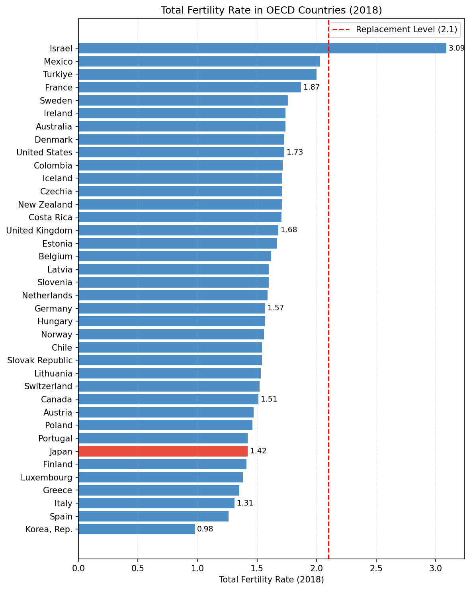
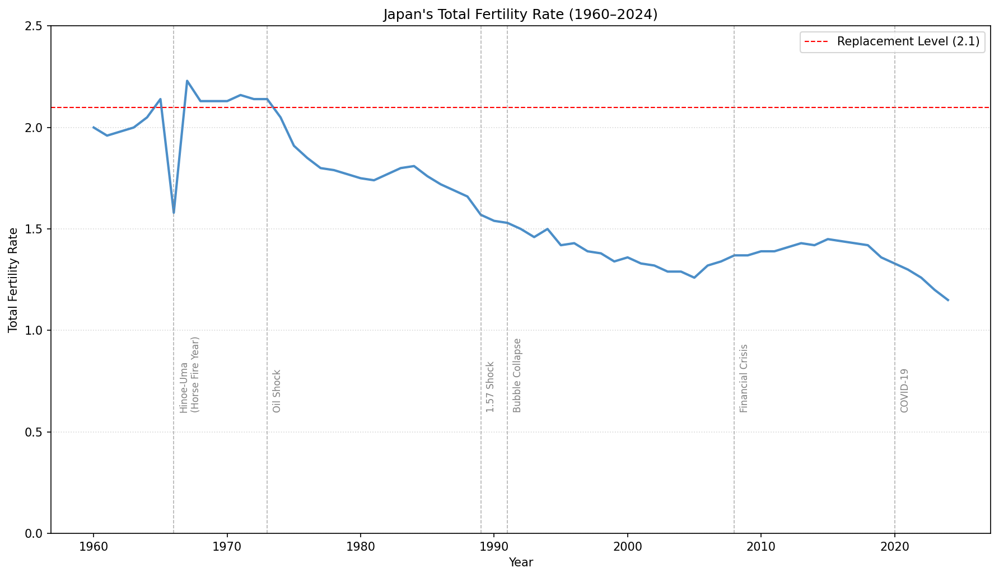
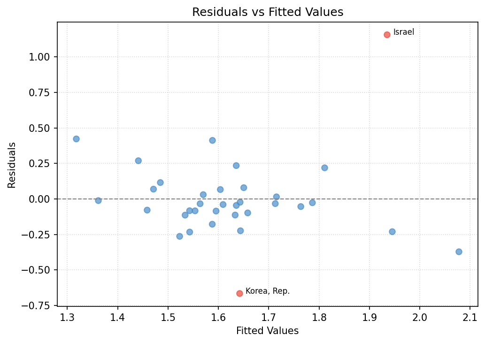
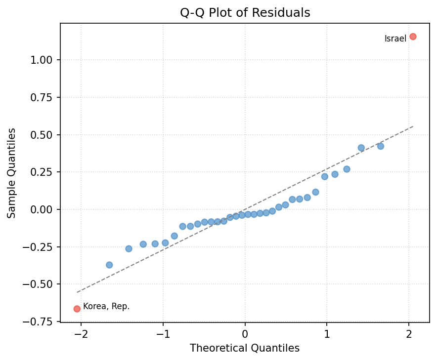
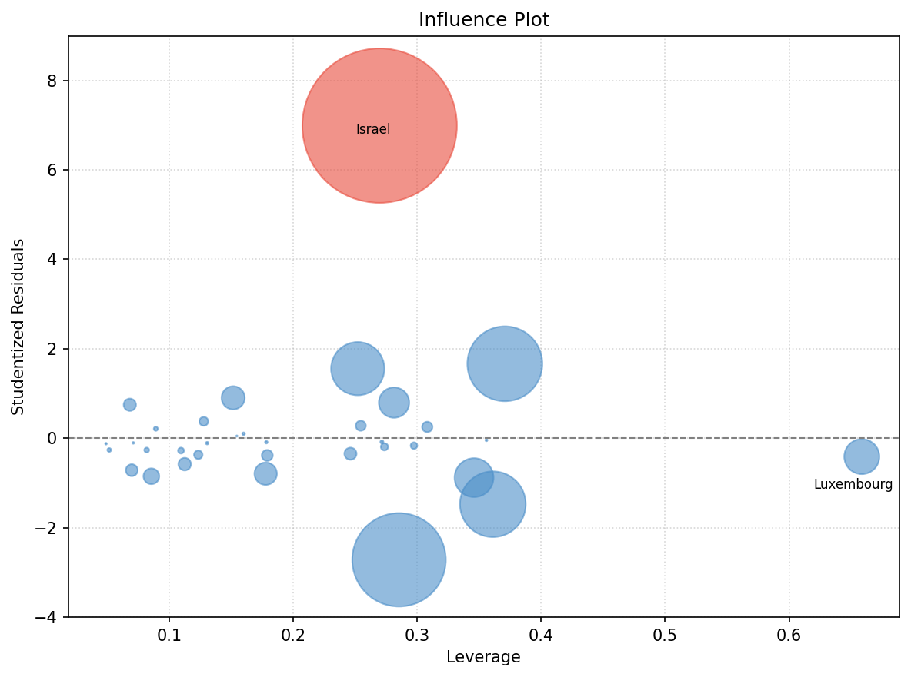

# OECD諸国における出生率の決定要因分析

## Overview

少子化は日本をはじめ多くの先進国が直面する重要な社会課題である。本分析では、OECD加盟国を対象に、出生率（合計特殊出生率）の国際的な決定要因を重回帰分析（OLS）によって探索的に検討した。

単純な相関分析にとどまらず、多重共線性の検証・残差診断・影響度分析（Cook's Distance）まで踏み込むことで、OLSの前提条件を詳細に確認している。また、統計的に有意な外れ値を特定した上で感度分析を行い、分析結果の頑健性を検証した。

本分析は「相関の確認」を目的とするものであり、因果関係の特定には都道府県レベルのパネルデータを用いた因果推論（差分の差分法・固定効果モデル）が別途必要である（後続プロジェクト参照）。

---

## Data

World Bank Open Dataから7変数を個別に取得・結合した。分析対象はOECD加盟38カ国（欠損値処理後34カ国）、対象年は2018年（ジニ係数のデータが最も充実している年）である。

| 変数 | 指標 | 出典 |
|---|---|---|
| 合計特殊出生率（目的変数） | 出生率 | World Bank |
| GDP per capita（一人当たりGDP・PPP実質） | 豊かさ | World Bank |
| ジニ係数 | 経済格差 | World Bank |
| 女性労働参加率 | 機会費用 | World Bank |
| 女性大学進学率（gross） | 晩婚化 | World Bank |
| 人口密度 | 都市化 | World Bank |
| 政府教育支出（% of GDP） | 子育てコスト | World Bank |

複数ソースのデータをISO3国コードをキーに結合するデータ整形を含む。

---

## Analysis Flow

```
データ取得・結合（World Bank）
    ↓
OECD加盟国への絞り込み・欠損値処理
    ↓
EDA（探索的データ分析）
    ↓
OLS回帰（全34カ国）
    ↓
回帰診断（VIF・残差プロット・Q-Qプロット・Influence Plot）
    ↓
感度分析（外れ値イスラエル除外・33カ国）
    ↓
考察
```

---

## EDA

### OECD諸国の合計特殊出生率（2018年）



2018年時点でOECD加盟国の中で人口維持水準（2.1）を超えているのはイスラエル（3.09）のみである。日本（1.42）・韓国（0.98）は最低水準に位置し、G7各国も全て維持水準を下回っている。

### 相関分析

各説明変数と出生率の相関係数（ピアソン）は以下の通りである。

| 変数 | 相関係数（イスラエルあり） | 相関係数（イスラエルなし） |
|---|---|---|
| GDP per capita | -0.16 | -0.16 |
| ジニ係数 | +0.27 | +0.25 |
| 女性労働参加率 | +0.09 | -0.07 |
| 女性大学進学率 | -0.13 | -0.08 |
| **人口密度** | **+0.03** | **-0.39** |
| 政府教育支出 | +0.27 | +0.26 |

注目すべき点として、ジニ係数と出生率の相関が正（+0.27）であることが挙げられる。「格差が拡大するほど出生率が低下する」という直感に反した結果であるが、これはメキシコ・コスタリカ・コロンビアなど「高格差かつ高出生率」の国がOECD内に存在するためと考えられる。また女性労働参加率は出生率とほぼ無相関（+0.09）であり、「女性が働くと出産しない」という仮説がOECD加盟国間では成立しないことを示している（北欧諸国は高い女性就業率と相対的に高い出生率を両立している）。

人口密度についてはイスラエルの除外前後で相関係数が大きく変化する（+0.03 → -0.39）。イスラエルは「高密度かつ高出生率」という例外的な特性を持ち、この1カ国が人口密度と出生率の関係を隠蔽していたことが示唆される。

---

## OLS

説明変数は全てStandardScalerで標準化した上でOLS回帰を行った。係数の大きさが変数間で直接比較可能になる。

### 全34カ国

| | 係数 | p値 |
|---|---|---|
| Intercept | 1.625 | 0.000 |
| GDP per capita | -0.058 | 0.399 |
| ジニ係数 | +0.094 | 0.176 |
| 女性労働参加率 | +0.037 | 0.616 |
| 女性大学進学率 | -0.039 | 0.554 |
| 人口密度 | +0.030 | 0.612 |
| 政府教育支出 | +0.110 | 0.101 |

R² = 0.227、**調整済みR² = 0.055**、F統計量 p = 0.283

全説明変数のp値が0.05を超えており、モデル全体も統計的に非有意である。

### イスラエル除外（33カ国）

| | 係数 | p値 |
|---|---|---|
| Intercept | 1.580 | 0.000 |
| GDP per capita | -0.011 | 0.799 |
| ジニ係数 | +0.026 | 0.543 |
| 女性労働参加率 | -0.042 | 0.358 |
| 女性大学進学率 | -0.045 | 0.263 |
| **人口密度** | **-0.075** | **0.054** |
| **政府教育支出** | **+0.076** | **0.065** |

R² = 0.309、**調整済みR² = 0.149**、F統計量 p = 0.113

イスラエルを除外することで調整済みR²が0.055 → 0.149に改善した。人口密度（p=0.054）と政府教育支出（p=0.065）において一定の傾向が見られる。5%水準では非有意であるが10%水準では有意であり、サンプルサイズ（33カ国）の制約を踏まえると示唆として解釈できる。

政府教育支出の係数（+0.076）は、1標準偏差（約1.25%pt・対GDP比）の増加ごとに出生率が約0.08ポイント増加する傾向を示す。ただしこれはOECD33カ国の平均的な関係であり、日本への直接適用を意味するものではない。

---

## Japan's Fertility Rate: Historical Trends



日本の合計特殊出生率は1960年代から長期的な低下傾向にある。主要な転換点は以下の通りである。

- **1966年（丙午）**：「丙午生まれの女性は夫の命を縮める」という迷信から出産を避ける夫婦が急増し、出生率が1.58まで急落した。翌年には2.23に回復しており、迷信という非経済的要因が出生率を大きく動かした事例として特筆される
- **1973年（オイルショック）**：第二次ベビーブーム（1971〜1974年）を最後に出生率の長期低下トレンドが始まった。経済的不安定化・高度経済成長の終焉が出産行動に影響を与えたと考えられる
- **1989年（1.57ショック）**：出生率が1.57まで低下し、丙午年（1966年）の1.58を初めて下回った。「丙午でもないのに1966年より低い」という事実が社会的衝撃を与え、日本の少子化対策の出発点となった
- **1991年（バブル崩壊）**：経済的不安定化を背景に出生率の低下が加速した
- **2005年前後（底打ち・緩やかな回復）**：出生率は2005年に1.26まで低下した後、少子化対策の拡充（保育所整備・育児休業制度の改善等）を背景に2015年の1.45まで緩やかな回復傾向を示した
- **2020年（COVID-19）**：回復傾向が反転し、感染拡大による将来不安・結婚・出産の先送りから出生率が再び急落した

2024年時点で出生率は1.2を下回る水準まで低下しており、人口維持水準（2.1）との乖離は拡大し続けている。OECDの国際比較では捉えきれない日本固有の経済・社会・文化的背景が存在することが示唆され、都道府県レベルの詳細な分析が必要である。

---

## Regression Diagnostics

回帰診断はイスラエル除外の根拠を統計的に確認するため、全34カ国（イスラエルあり）のモデルに対して実施した。

### 多重共線性（VIF）

| 変数 | VIF |
|---|---|
| 女性労働参加率 | 1.75 |
| ジニ係数 | 1.51 |
| GDP per capita | 1.49 |
| 政府教育支出 | 1.39 |
| 女性大学進学率 | 1.37 |
| 人口密度 | 1.13 |

全変数でVIF < 2と多重共線性の問題は認められない。全変数のp値が有意でなかった原因は多重共線性ではなく、サンプルサイズ（34カ国）の小ささと外れ値の影響によるものと考えられる。

### 残差プロット



全体として概ね等分散であり、均一分散の仮定に大きな問題は見られない。ただしイスラエル（残差+1.16）と韓国（残差-0.67）の2カ国が外れ値の可能性として確認される。

### 正規Q-Qプロット



中央の点群は参照線に沿っているが、両端がそれぞれ線から離れている（左端の韓国が参照線より下、右端のイスラエルが参照線より上）。この形状は裾が重い分布（leptokurtic）を示しており、OLSサマリーのKurtosis（尖度）9.032と一致している。イスラエル（正方向）と韓国（負方向）の2つの外れ値が残差の正規性を歪めている。

韓国はOECD内で突出して低い出生率（0.977）を持ち、モデルが捉えきれない固有の要因（超少子化・高学歴化・住宅コスト等）が存在する可能性を示唆している。イスラエルは宗教・文化的背景による例外的な高出生率国であり、いずれもOLS回帰の説明変数では捉えにくい構造的な特殊性を持つ。

### Influence Plot



各点の大きさはCook's Distanceに比例しており、大きいほどモデル全体への影響力が大きいことを示す。
Cook's Distanceが外れ値の基準（0.5）を超えるのはイスラエルのみ（0.93）であり、モデル全体への影響力が大きい外れ値と判断される。
ルクセンブルクはLeverageが高い（0.66）ものの、Cook's Distanceは小さく（0.5以下）、説明変数の空間では他国から離れた位置にある（極端に高いGDP per capita）が、モデルへの実質的な影響は限定的である。
統計的に有意な外れ値はイスラエルのみと結論づける。

---

## Discussion

本分析における主な知見は以下の通りである。

**①「格差と出生率」の相関は直感に反する**  
ジニ係数と出生率の相関は正（+0.25〜+0.27）であり、「格差が拡大するほど出生率が低下する」という仮説はOECD加盟国の単純な相関分析では支持されなかった。これはメキシコ・コスタリカ・コロンビアなど「高格差かつ高出生率」の国が結果を歪めている可能性があり、交絡を除いたより精緻な分析が必要である。

**②女性労働参加率と出生率は無相関**  
OECD加盟国においては「女性が働くほど出産しない」という関係は成立しない。北欧諸国のように高い女性就業率と相対的に高い出生率を両立している国が存在し、単純な負の関係が打ち消されていると考えられる。

**③外れ値の影響が大きい**  
Cook's Distanceの分析により、イスラエルがモデルに与える影響が統計的に有意（Cook's D = 0.93）であることが確認された。イスラエルを除外することでモデルの説明力が改善（調整済みR²: 0.055 → 0.149）し、人口密度・政府教育支出に一定の傾向が見られるようになった。

**④本分析の限界と今後の課題**  
本分析はOECD加盟国34カ国・1時点（2018年）のクロスセクション分析であり、サンプルサイズが小さく、国固有の特性や時間的変化を捉えられないという制約がある。また相関関係が確認されたとしても、それが因果関係を意味するわけではない。格差指標（特に非正規雇用率）と出生率の因果効果の特定には、都道府県レベルのパネルデータを用いた固定効果モデル・差分の差分法による分析が必要であり、後続プロジェクトにて検討する。

---

## Libraries

pandas / numpy / scipy / statsmodels / scikit-learn / matplotlib / plotly

---

## Data Sources

- [World Bank Open Data](https://data.worldbank.org/)
  - Total Fertility Rate: `SP.DYN.TFRT.IN`
  - GDP per capita, PPP (constant 2021 international $): `NY.GDP.PCAP.PP.KD`
  - Gini Index: `SI.POV.GINI`
  - Labor Force Participation Rate, Female (% of female population ages 15+): `SL.TLF.CACT.FE.ZS`
  - School Enrollment, Tertiary, Female (% gross): `SE.TER.ENRR.FE`
  - Population Density (people per sq. km of land area): `EN.POP.DNST`
  - Government Expenditure on Education (% of GDP): `SE.XPD.TOTL.GD.ZS`
